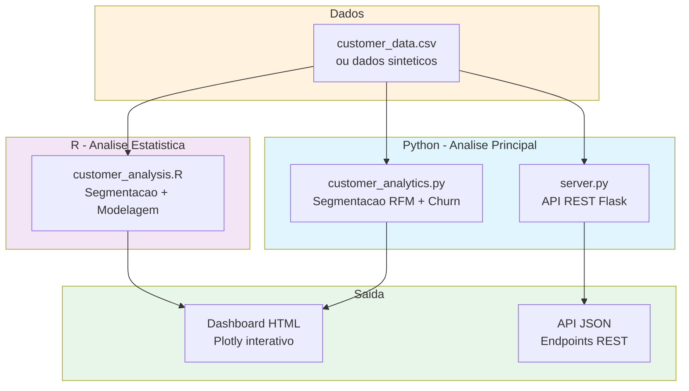
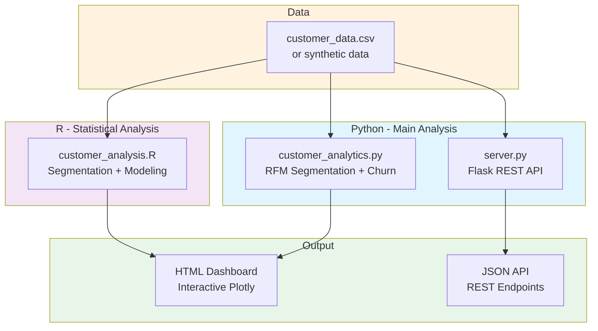

# Customer Behavior Analytics

[](https://www.python.org/)
[](https://www.r-project.org/)
[](https://flask.palletsprojects.com/)
[](LICENSE)

[English](#english) | [Portugues](#portugues)

---

## Portugues

### Visao Geral

Projeto de analise de comportamento de clientes usando Python e R. Realiza segmentacao de clientes via KMeans (analise RFM — Recency, Frequency, Monetary), previsao de churn com Random Forest, e gera dashboards interativos com Plotly. Inclui uma API REST minima em Flask para consultar dados de clientes.

### Arquitetura



### Funcionalidades

- **Segmentacao RFM**: Agrupa clientes por recencia, frequencia e valor monetario usando KMeans
- **Previsao de Churn**: Modelo Random Forest para identificar clientes em risco de abandono
- **Dashboard Interativo**: Graficos 3D, barras, pizza e boxplots via Plotly (salvo como HTML)
- **API REST**: Endpoints Flask para consulta de clientes, demografias e resumo de compras
- **Analise em R**: Script alternativo com segmentacao hierarquica, RFM scoring e visualizacoes ggplot2
- **Dados Sinteticos**: Gera dados automaticamente quando nao ha CSV real disponivel

### Estrutura do Projeto

```
Customer-Behavior-Analytics/
├── src/
│   ├── __init__.py
│   ├── customer_analytics.py   # Classe principal: RFM, KMeans, churn, dashboard
│   ├── customer_analysis.R     # Analise estatistica em R
│   └── server.py               # API REST Flask
├── tests/
│   └── test_customer_analytics.py
├── config/
│   └── requirements.txt
├── data/                       # Diretorio para dados CSV (gitignored)
├── LICENSE
└── README.md
```

### Como Executar

```bash
# Clonar o repositorio
git clone https://github.com/galafis/Customer-Behavior-Analytics.git
cd Customer-Behavior-Analytics

# Criar ambiente virtual
python -m venv venv
source venv/bin/activate  # Windows: venv\Scripts\activate

# Instalar dependencias
pip install -r config/requirements.txt

# Executar analise completa (gera dashboard HTML)
python -m src.customer_analytics

# Executar API REST
python -m src.server
```

### Testes

```bash
python -m pytest tests/ -v
```

### Tecnologias

| Tecnologia | Uso |
|------------|-----|
| Python | Linguagem principal |
| pandas / NumPy | Processamento de dados |
| scikit-learn | KMeans, Random Forest, metricas |
| Plotly | Dashboards interativos |
| Flask | API REST |
| R | Analise estatistica alternativa |

---

## English

### Overview

Customer behavior analytics project using Python and R. Performs customer segmentation via KMeans (RFM analysis — Recency, Frequency, Monetary), churn prediction with Random Forest, and generates interactive dashboards with Plotly. Includes a minimal Flask REST API for querying customer data.

### Architecture



### Features

- **RFM Segmentation**: Groups customers by recency, frequency and monetary value using KMeans
- **Churn Prediction**: Random Forest model to identify customers at risk of leaving
- **Interactive Dashboard**: 3D scatter, bar, pie and box plots via Plotly (saved as HTML)
- **REST API**: Flask endpoints for querying customers, demographics and purchase summaries
- **R Analysis**: Alternative script with hierarchical clustering, RFM scoring and ggplot2 visualizations
- **Synthetic Data**: Automatically generates data when no real CSV is available

### Project Structure

```
Customer-Behavior-Analytics/
├── src/
│   ├── __init__.py
│   ├── customer_analytics.py   # Main class: RFM, KMeans, churn, dashboard
│   ├── customer_analysis.R     # Statistical analysis in R
│   └── server.py               # Flask REST API
├── tests/
│   └── test_customer_analytics.py
├── config/
│   └── requirements.txt
├── data/                       # Directory for CSV data (gitignored)
├── LICENSE
└── README.md
```

### How to Run

```bash
# Clone the repository
git clone https://github.com/galafis/Customer-Behavior-Analytics.git
cd Customer-Behavior-Analytics

# Create virtual environment
python -m venv venv
source venv/bin/activate  # Windows: venv\Scripts\activate

# Install dependencies
pip install -r config/requirements.txt

# Run full analysis (generates HTML dashboard)
python -m src.customer_analytics

# Run REST API
python -m src.server
```

### Tests

```bash
python -m pytest tests/ -v
```

### Technologies

| Technology | Usage |
|------------|-------|
| Python | Primary language |
| pandas / NumPy | Data processing |
| scikit-learn | KMeans, Random Forest, metrics |
| Plotly | Interactive dashboards |
| Flask | REST API |
| R | Alternative statistical analysis |

---

### Autor / Author

**Gabriel Demetrios Lafis**
- GitHub: [@galafis](https://github.com/galafis)
- LinkedIn: [Gabriel Demetrios Lafis](https://linkedin.com/in/gabriel-demetrios-lafis)

### Licenca / License

MIT License - veja [LICENSE](LICENSE) para detalhes / see [LICENSE](LICENSE) for details.
